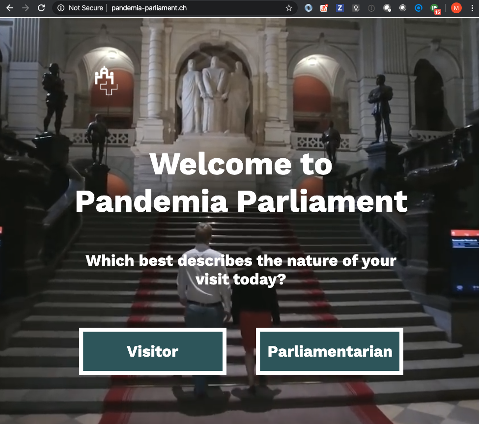
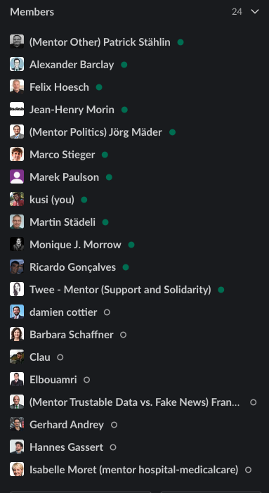

# Into

A video might say more than lots of words

[](https://www.youtube.com/watch?v=6EYLnA8p7dA)

[](https://www.youtube.com/watch?v=TEjx7UMNAlc)


## What's this about?

Democracy as we know it is heavily impacted by covid-19. Decisions can’t be taken, yet it’s more crucial than ever that politicians can do their job. Some parliaments forbid the general population to meet, but they themselves need to meet in person, as there is just no other way.


## What are we trying to achieve?
We want to give the parliament the possibility to meet and vote on their business online. Digitalisation on the fast track, from physical being under one roof to simply doing the same work in a safe virtual space. Politicians need to lead by example, staying at home is the first crucial step!

## Solution ShowCase

We take the parliamentary process from the real-world and transfer it online. As simple as this. Politicians enter the online-lobby, are admitted by people that know them and join the online debate. They can vote on their businesses, do break out sessions with their parliamentary groups and come to the best possible decisions that make our society a great place to live in.
The general public can join in from anywhere in the world and follow the process.
For this hackathon we build a simple ShowCase that gives an impression how an online parliament could look like. All build on Open Source technology, protecting our sovereignty and guaranteeing a high level of security and transparency.




# Acknolegment & Contributions


## Media about the topic

* https://www.letemps.ch/suisse/democratie-numerique
* https://www.republik.ch/2020/04/02/kinder-aus-lesbos-die-schweiz-sagt-nein-spitaeler-melden-kurz-arbeit-an-und-was-es-fuer-ein-digitales-parlament-braeuchte
* https://www.nzz.ch/amp/schweiz/die-halbe-schweiz-arbeitet-von-zuhause-aus-nur-das-parlament-will-sich-weiterhin-physisch-treffen-ld.1549953

## Collaborators, Hackers, Thinkers

| Who | Role | Wanna know more? |
|---------------------|---------------------------|------------------------------------|
| Kusi - Markus Roth | Ideator / Hacker | https://zebbra.ch / @MrChusiiii |
| Felix Hoesch | Political Advisor | http://felix.hoesch.ch / @FelixZRH |
| Clau Dermont | Political Advisor | http://claudermont.ch @claudermont |
| Patrick Stählin | Mentor / Hacker | https://patrickstaehlin.ch / @thepacki |
| Marek Paulson | Hacker | |
| Jean-Henry Morin | Researcher | @jhmorin |
| Martin Städeli | Advisor / Federal Council | |
| Claudio Sigenthaler | Hacker | |

## Supporters - advisors, mentors, coaches

* Here's a screenshot from all the very nice people that supported and advised us during the hackathon :) Thanks a lot!




# Tech Stuff

## Getting Started
---------------

Requirements: running mongodb

The easiest way to get started is to clone the repository:

```bash
# Get the latest snapshot
git clone https://github.com/zebbra/pandemia-parliament.git pandemia-parliament

# Change directory
cd myproject

# Install NPM dependencies
npm install

# Then simply start your app
node app.js
```

## Boilerplate used during the hackathon

https://github.com/sahat/hackathon-starter

